# Deep Q-Learning on Atari Final Project
Objective: This project aims to implement and analyze Deep Q-Networks (DQN) and their extensions by comparing and contrasting agent performance across two distinct Atari environments: Mario and Pong. The project will evaluate how both baseline DQN and extended DQN variants perform during early training phases versus later stages of learning, examining learning curves, behavioral patterns, and final performance metrics. Through this comparative analysis, the project seeks to understand how environmental complexity and algorithmic improvements interact to influence reinforcement learning outcomes in classic gaming environments.

## Early/Randomish vs Later/Learned
Watch how performance improves as training progresses:

### ALE/Mario-V5
| Episode    | Model             | Preview                                             | Video |
|------------|-------------------|-----------------------------------------------------|-------|
| Early      | DQN               | 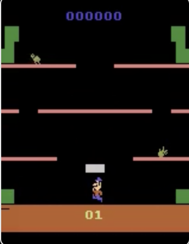    | <a href="https://github.com/user-attachments/assets/ca0baf3e-efcf-4ba2-9e6d-f0d83eb40813" target="_blank">▶ Watch</a>  |
| Later      | DQN               | 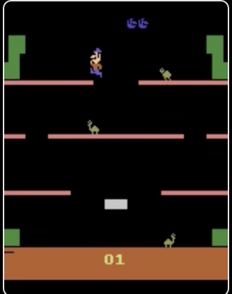    | <a href="https://github.com/user-attachments/assets/d0af8441-6432-487a-b4a0-3d2eca9b19f6" target="_blank">▶ Watch</a> |
| Early      | DDQN (250k)       | 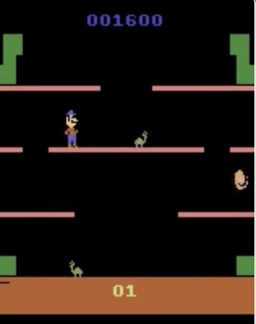   | <a href="https://github.com/user-attachments/assets/f4cf8a59-0661-4635-aa3a-04407fae288e" target="_blank">▶ Watch</a> |
| Later      | DDQN (250k)       | 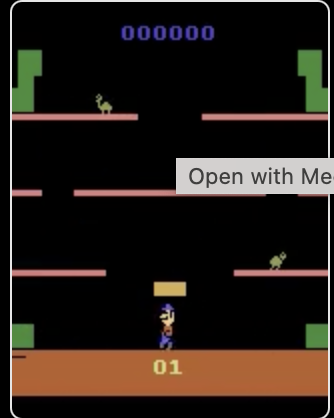   | <a href="https://github.com/user-attachments/assets/193328a9-7253-4282-9b34-286a2c7ac30b" target="_blank">▶ Watch</a> |
| Early      | DDQN (305k)       | 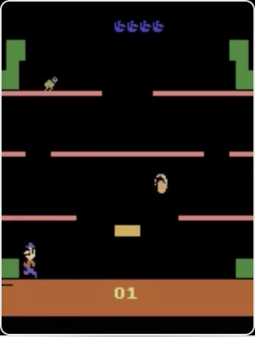   | <a href="https://github.com/user-attachments/assets/86df3a03-1508-4f34-ad5b-188ac53cbd28" target="_blank">▶ Watch</a> |
| Later      | DDQN (305k)       | 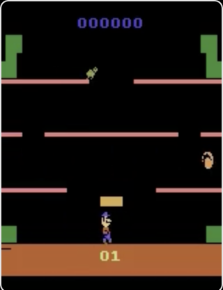   | <a href="https://github.com/user-attachments/assets/6f3c7a86-fd32-4137-aa8a-2408c89f130e" target="_blank">▶ Watch</a> |

 
### ALE/Pong-V5
| Episode    | Model             | Preview                                             | Video |
|------------|-------------------|-----------------------------------------------------|-------|
| Early      | Near-random (50k) | 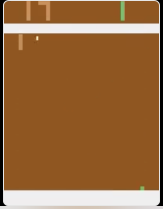         | <a href="https://github.com/user-attachments/assets/f53a75e4-d522-42d5-809f-a70978024860" target="_blank">▶ Watch</a> |
| Later      | DQN (50k)         | 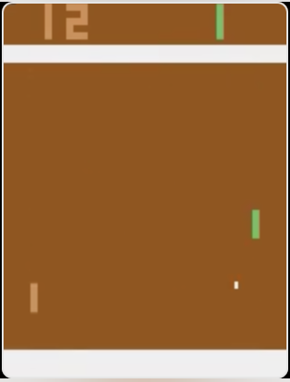     | <a href="https://github.com/user-attachments/assets/085d5fa9-a372-4724-b6e8-d4e25ca02376" target="_blank">▶ Watch</a> |
| Later      | DDQN(50k)         | 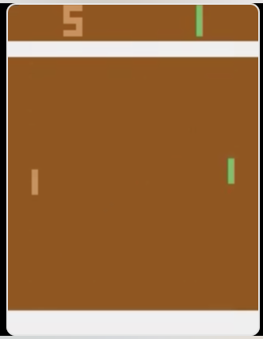         | <a href="https://github.com/user-attachments/assets/1695059b-d334-447c-87c3-fad1ab3d9825" target="_blank">▶ Watch</a> |
| Early      | Near-random (50k + change in learning rate + start time) ) | 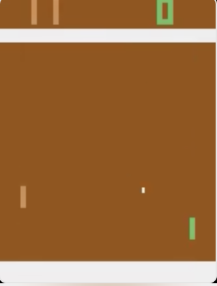      | <a href="https://github.com/user-attachments/assets/0ff3fce5-7ff6-49b1-b19f-be2a90cc00e5" target="_blank">▶ Watch</a> |
| Later      | DQN(50k + change in learning rate + start time)  | 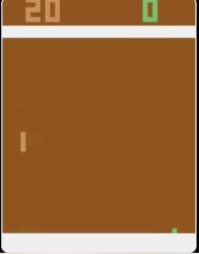       | <a href="https://github.com/user-attachments/assets/fbe71fd4-9084-4dfd-bbb7-52fa1652d607" target="_blank">▶ Watch</a> |
| Later      | DDQN (50k + change in learning rate + start time)| 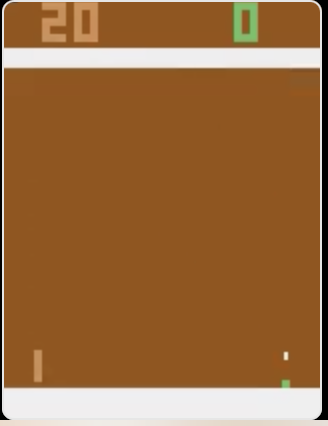       | <a href="https://github.com/user-attachments/assets/11dc55c5-f96d-4fce-93c5-69e27d38b551" target="_blank">▶ Watch</a> |
 
